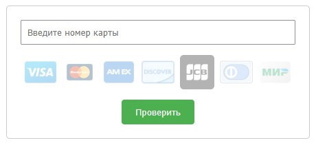

# Функциональность

## 🎯 Основные возможности

- **Определение платёжной системы** — при вводе номера карты автоматически подсвечивается соответствующий логотип (Visa, Mastercard, American Express, Discover, JCB, Diners Club, Мир).
- **Валидация по алгоритму Луна** — проверка корректности номера карты.
- **Проверка длины номера** — номер должен содержать от 13 до 19 цифр.
- **Модальное окно** — результат проверки отображается в стильном модальном окне, которое можно закрыть крестиком или кликом вне области.
- **Адаптивный дизайн** — виджет корректно отображается на мобильных устройствах.

## 🖼️ Демонстрация работы

  
*Пример работы виджета: ввод номера, подсветка логотипа, результат в модальном окне.*

## ⚙️ Детали реализации

- Определение типа карты происходит на основе массива конфигураций (префиксы и диапазоны), что упрощает добавление новых платёжных систем.
- Алгоритм Луна реализован в отдельной функции и покрыт тестами.
- Взаимодействие с DOM вынесено в класс `CardValidatorWidget`, а управление картами — в класс `CardManager`.
- Для модального окна создан отдельный класс `Modal`.